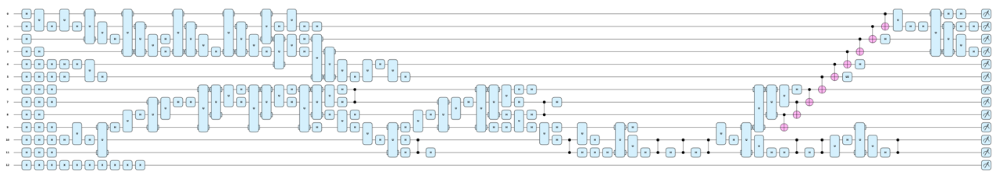
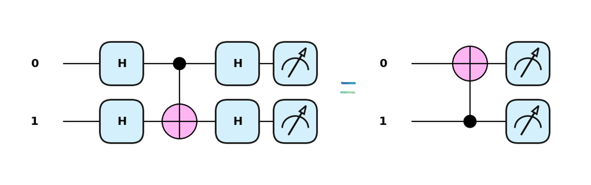
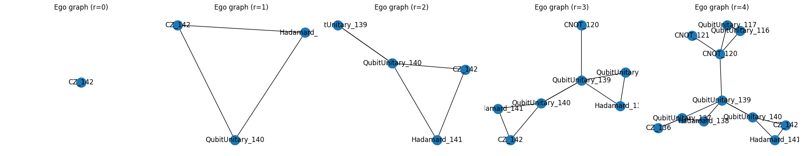
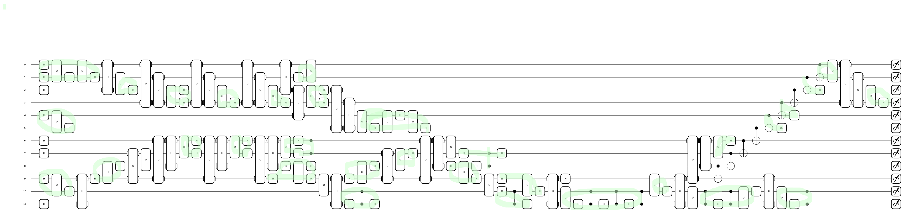
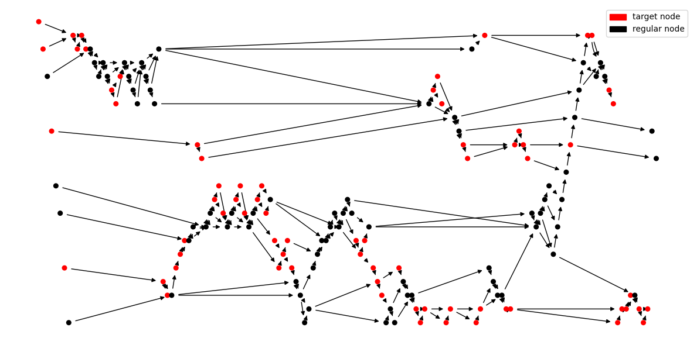
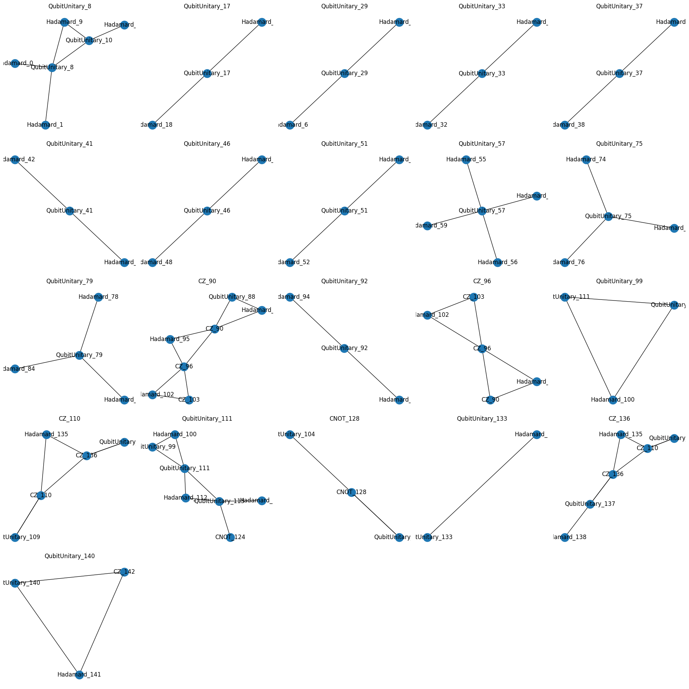

# Quantum-transpilation

## 1. PennyLane to Qiskit Converter (comparison/Penny_to_qiskit.py)

 
  While PennyLane supports converting circuits from Qiskit to its own format, it does not currently offer a method for converting PennyLane circuits back to Qiskit. So I have made one myself!😊
  Designed to transform KetGPT circuits—which consist of only eight predefined gates—this class cannot handle arbitrary gates by default. However, you can easily tailor it by adding Qiskit–PennyLane gate correspondences in the convert_to_qiskit() function. In addition, you can print the comparison table, compares the performance of Qiskit's and PennyLane's transpilers.

 

## 2. Quantum Transpiler Performance Comparison (comparison/compare_decomposition.ipynb)

 
  

  
Fig. 1. Performance of Qiskit's and PennyLane's transpilers

  This code prints a table comparing the performance of different quantum transpilers. Specifically, Qiskit's transpiler across optimization levels 0 to 3, and PennyLane's default compilation   strategy. Note that the number of unitary gates drops to zero at optimization levels 2 and 3 due to unitary synthesis, which decomposes unitary gates into 1- or 2-qubit primitive gates. Additionally, PennyLane's default compilation applies only few techniques such as commutation cancellation, inverse cancellation, rotation merging, and barrier removal and therefore does not show outstanding performance as it is. However, PennyLane offers <a href='https://docs.pennylane.ai/en/stable/introduction/compiling_circuits.html'> a number of optimization functions</a>, with which users can build up their own pipelines. Lastly, the fidelity for PennyLane's compiler cannot be calculated due to the decrease in the number of qubits; if we figure out which qubit is discarded, we can compute it, though.

 

## 3. Graph representation of quantum circuits (circuit_optimization/graph_representation/penny_to_graph.py)

 
  

  
Fig. 2. Quantum circuit generate by KetGPT

  

  
Fig. 3.Graph representation of the quantum circuit

  Quantum circuit optimization aims to reduce the number of gates and the depth, while maintaing the fidelity. Once quantum circuits are represented as graphs, we can apply graph algorithms to them!
  As a major example, Qiskit's transpiler converts quantum circuits to graphs, perform the Dijkstra search over them to replace known gate patterns with more efficient ones. Here I present a module to bridge PennyLane and NetworkX, which converts a quantum circuit in PennyLane to a graph object in NetworkX.

 

## 4. Hardware-independent quantum circuit optimization on graphs (circuit_optimization/hw_independent/)

 
  Most conventional approaches rely on pattern matching, which typically involves the following steps: (1) template preparation, (2) pattern search across quantum circuits, (3) subcircuit replacement, and (4) iteration of steps (2) and (3) until no further matches are found. Successful optimization hinges on complete templates and efficient search strategies. However, manually crafting substitution rules is time-consuming, and incomplete rule sets can lead to performance degradation. Here, I present a hardware-independent, template-free strategy for quantum circuit optimization. The algorithm leverages the often-overlooked insight that substitution rules are implicitly applied through a series of matrix multiplications. Gates are first grouped by the greedy modularity community detection algorithm, and then consolidated into a single unitary gate. This approach enables effective circuit cleanup as a preprocessing step, streamlining messy designs before further optimization.  

### (1) 1-qubit gate optimization

  Single-qubit gates can be effectively groupped by setting multi-qubit gates as barriers and appyling the community detection algorithm. In Fig.4 each community is colored differently. Afterwards, the effective unitary each community results in is calculated and transfored to basis single-qubit gate. During this process, gate cancellation between single-qubit gates are implicitly done!

 
  

  
Fig. 4. single-qubit gate optimization

  

  
Fig. 5. After single-qubit gate optimization

### (2) 2-qubit gate optimization

  Rather than applying the previous approach for single-qubit gates, I have prepared a different approach for 2-qubit gates: after other gates are removed, each connected component is examined. Once the pair of nodes which share two edges is detected, these are removed from the original gate. Note that this graph algorithm hands the list of gates to remove over to the original circuit!

 
  

  
Fig. 6.two-qubit gate optimization

  

  
Fig. 7. After two-qubit gate optimization

### (3) single and double- qubit gate joint optimization

  At this stage, I aim to group single- and two-qubit gates that act on the same wires to assess whether they can be optimized. Figure 8 illustrates an example of such optimization. 
    
  

  
Fig. 8.Example of joint optimization

   
  Gates can be grouped as in Fig 9 with the help of ego graphs. In graph theory, an ego graph refers to a graph centered on a specific node. You can construct it by using <bold>nx.ego_graph(G, center, radius)</bold> in NetworkX.
  Here the 'radius' denotes how many steps you take from the center node to include further nodes in the ego graph. If you set the radius as zero, the ego node is sole node in the graph!
  Gates can be grouped, as shown in Fig. 9, using <bold>ego graphs</bold>. In graph theory, an ego graph is a subgraph centered on a specific node, capturing its local neighborhood (Fig 9). You can construct one yourself in NetworkX using <i>nx.ego_graph(G, center, radius)</i>. Here the radius parameter determines how many steps away from the center node to include neighboring nodes (note that it is just like k-nearest neighbors). If you set the radius to zero, the ego graph will contain only the center node itself!
    
  

  
Fig. 9. Evolution of the ego graph of a CZ gate

   
  One limitation of ego graph evolution is that it expands uniformly in all directions, regardless of contextual relevance. To address this, I relax the node selection criteria and allow the evolution to proceed as long as not all neighboring     nodes deviate from the center node's wire set. Gates that violate this condition are subsequently removed from their subgraphs, and unique subgraphs are identified using graph isomorphism. This process reveals subgraphs with potential for       optimization; these groups of nodes are highlighted in red in Fig. 10, and their corresponding graph representations are shown in Fig. 12.

 
  

  
Fig. 10.Gate groups in consideration

  

  
Fig. 11.Gate groups detected on the graph

  

  
Fig. 12. Targeted gate groups successfully detected

  
### (4) Results
Updated very soon!
<!-- 

Fig. 10. Quantum circuit preprocessed by PennyLane's compiler

Fig. 11. Quantum circuit preprocessed by my strategy!
 -->
  
## Further optimization methods will be coming! 😉
