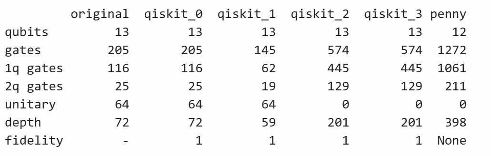

# Quantum-transpilation
## 1. PennyLane to Qiskit Converter (comparison/Penny_to_qiskit.py)

 
  While PennyLane supports converting circuits from Qiskit to its own format, it does not currently offer a method for converting PennyLane circuits back to Qiskit. So I have made one myself!😊
  Designed to transform KetGPT circuits—which consist of only eight predefined gates—this class cannot handle arbitrary gates by default. However, you can easily tailor it by adding Qiskit–PennyLane gate correspondences in the convert_to_qiskit() function. In addition, you can print the comparison table, compares the performance of Qiskit's and PennyLane's transpilers.

## 2. Quantum Transpiler Performance Comparison (comparison/compare_decomposition.ipynb)

 
  

  
Fig. 1. Performance of Qiskit's and PennyLane's transpilers

  This code prints a table comparing the performance of different quantum transpilers. Specifically, Qiskit's transpiler across optimization levels 0 to 3, and PennyLane's default compilation   strategy. Note that the number of unitary gates drops to zero at optimization levels 2 and 3 due to unitary synthesis, which decomposes unitary gates into 1- or 2-qubit primitive gates. Additionally, PennyLane's default compilation applies only few techniques such as commutation cancellation, inverse cancellation, rotation merging, and barrier removal and therefore does not show outstanding performance as it is. However, PennyLane offers <a href='https://docs.pennylane.ai/en/stable/introduction/compiling_circuits.html'> a number of optimization functions</a>, with which users can build up their own pipelines. Lastly, the fidelity for PennyLane's compiler cannot be calculated due to the decrease in the number of qubits; if we figure out which qubit is discarded, we can compute it, though.

