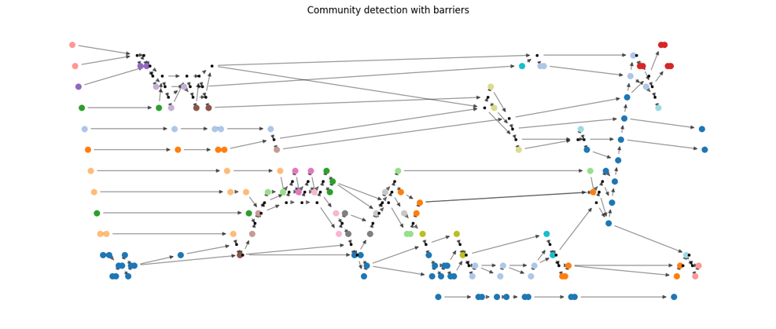

# Quantum-transpilation

## 1. PennyLane to Qiskit Converter (comparison/Penny_to_qiskit.py)

 
  While PennyLane supports converting circuits from Qiskit to its own format, it does not currently offer a method for converting PennyLane circuits back to Qiskit. So I have made one myself!😊
  Designed to transform KetGPT circuits—which consist of only eight predefined gates—this class cannot handle arbitrary gates by default. However, you can easily tailor it by adding Qiskit–PennyLane gate correspondences in the convert_to_qiskit() function. In addition, you can print the comparison table, compares the performance of Qiskit's and PennyLane's transpilers.

 

## 2. Quantum Transpiler Performance Comparison (comparison/compare_decomposition.ipynb)

 
  

  
Fig. 1. Performance of Qiskit's and PennyLane's transpilers

  This code prints a table comparing the performance of different quantum transpilers. Specifically, Qiskit's transpiler across optimization levels 0 to 3, and PennyLane's default compilation   strategy. Note that the number of unitary gates drops to zero at optimization levels 2 and 3 due to unitary synthesis, which decomposes unitary gates into 1- or 2-qubit primitive gates. Additionally, PennyLane's default compilation applies only few techniques such as commutation cancellation, inverse cancellation, rotation merging, and barrier removal and therefore does not show outstanding performance as it is. However, PennyLane offers <a href='https://docs.pennylane.ai/en/stable/introduction/compiling_circuits.html'> a number of optimization functions</a>, with which users can build up their own pipelines. Lastly, the fidelity for PennyLane's compiler cannot be calculated due to the decrease in the number of qubits; if we figure out which qubit is discarded, we can compute it, though.

 

## 3. Graph representation of quantum circuits (circuit_optimization/graph_representation/penny_to_graph.py)

 
  

  
Fig. 2. Quantum circuit generate by KetGPT

  

  
Fig. 3.Graph representation of the quantum circuit

  Quantum circuit optimization aims to reduce the number of gates and the depth, while maintaing the fidelity. Once quantum circuits are represented as graphs, we can apply graph algorithms to them!
  As a major example, Qiskit's transpiler converts quantum circuits to graphs, perform the Dijkstra search over them to replace known gate patterns with more efficient ones. Here I present a module to bridge PennyLane and NetworkX, which converts a quantum circuit in PennyLane to a graph object in NetworkX.

 

## 4. Quantum circuit optimization with community detection (circuit_optimization/hw_independent/unitary_synthesis_4_fs.ipynb)

 
  

  
Fig. 4. Community detection with barriers

  Most conventional approaches rely on pattern matching, which typically involves the following steps: (1) template preparation, (2) pattern search across quantum circuits, (3) subcircuit replacement, and (4) iteration of steps (2) and (3) until no further matches are     found. Successful optimization hinges on complete templates and efficient search strategies. However, manually crafting substitution rules is time-consuming, and incomplete rule sets can lead to performance degradation. Here, I present a hardware-independent, template-free strategy for quantum circuit optimization. The algorithm leverages the often-overlooked insight that substitution rules are implicitly applied through a series of matrix multiplications. Gates are first grouped by the greedy modularity community detection algorithm, and then consolidated into a single unitary gate. This approach enables effective circuit cleanup as a preprocessing step, streamlining messy designs before further optimization.  
  

  
Fig. 5. Quantum circuit preprocessed by PennyLane's compiler

  

  
Fig. 6. Quantum circuit preprocessed by my strategy. You can get the same result as Penny's!

 

